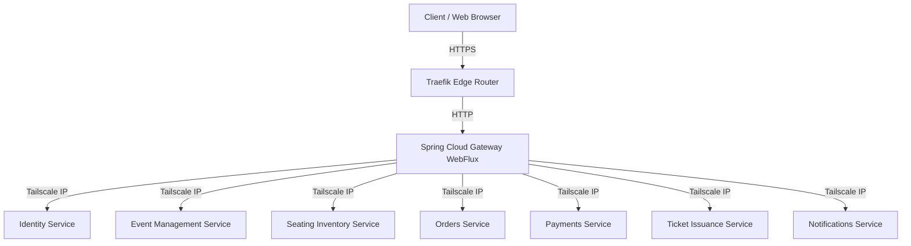

# Orion API Gateway Architecture

This document describes the architectural design of the independent API Gateway for the OrionTicket platform.

## Overview

The API Gateway acts as the single entry point for all client requests to the OrionTicket microservices. The architecture is split into two layers:
1. **Edge Router Layer (Traefik)**: Handles TLS termination, Let's Encrypt certificate auto-renewal, request routing to the gateway container, and basic load balancing.
2. **API Gateway Layer (Spring Cloud Gateway)**: Handles path-based routing, header preservation, microservice mapping, and cross-cutting concerns (logging, metrics).

## Core Components

### 1. Traefik Proxy
Traefik is a modern HTTP reverse proxy and load balancer. In this deployment:
- It listens on ports `80` (HTTP) and `443` (HTTPS).
- It performs an automatic HTTP-to-HTTPS redirect for all traffic.
- It dynamically resolves TLS certificates via Let's Encrypt using HTTP challenge.
- It discovers the API Gateway container using Docker provider labels.

### 2. Spring Cloud Gateway (WebFlux)
Built on top of Spring Boot and Project Reactor, Spring Cloud Gateway provides non-blocking, reactive API routing:
- **Reactive Model**: Uses Netty as the embedded server to handle a large number of concurrent connections with low memory usage.
- **Route Predicates & Filters**: Matches incoming HTTP request paths and applies filters (such as `PreserveHostHeader`) before forwarding the request.
- **Tailscale Integration**: Integrates directly with Tailscale private network IPs for secure, internal node-to-node communication.

## Request Lifecycle

1. **Incoming Request**: Client requests `https://api.orionticket.example/v1/events/123`.
2. **TLS Termination**: Traefik receives the request, decrypts TLS using Let's Encrypt certificates, and forwards the HTTP traffic to the `orion-api-gateway` container.
3. **Gateway Predicate Match**: Spring Cloud Gateway matches `/v1/events/**` against the routes list.
4. **Filter Execution**: The `PreserveHostHeader` filter is applied to keep the original Host header intact for downstream services.
5. **Upstream Forwarding**: The Gateway forwards the request to the Event Management Service upstream (e.g. `http://100.64.0.12:8082/v1/events/123`).
6. **Response Return**: The upstream response flows back through the Gateway and Traefik to the client.
